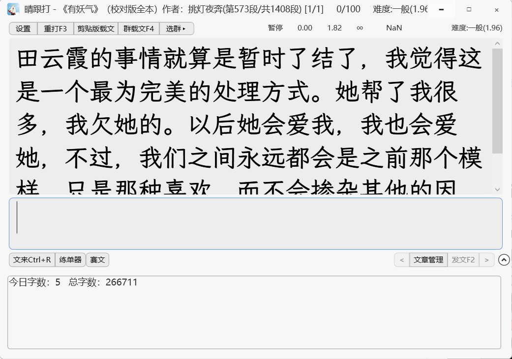
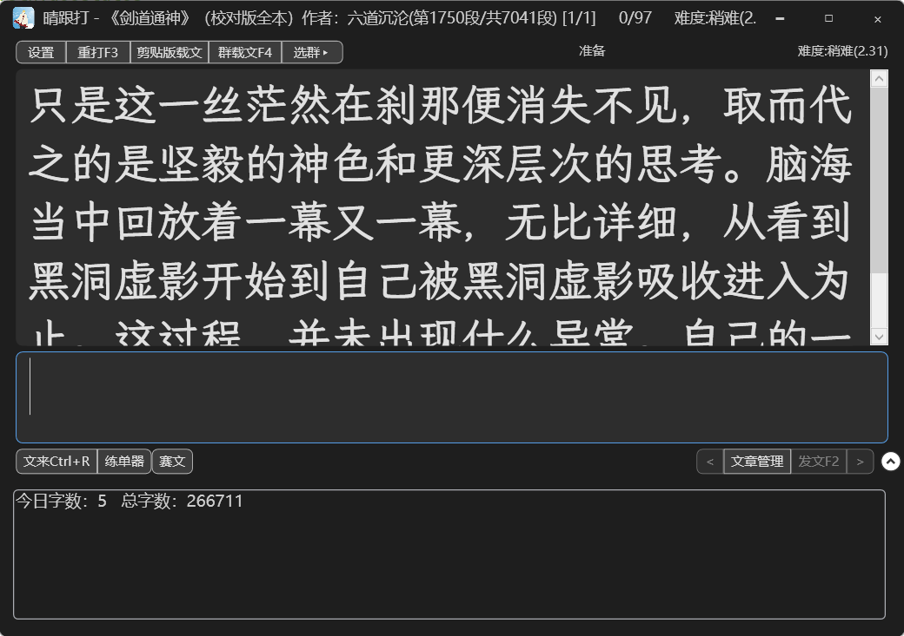
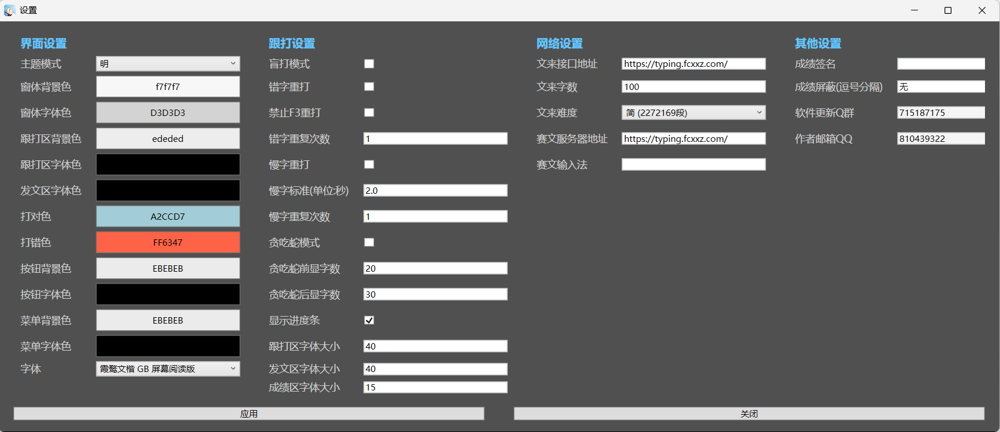
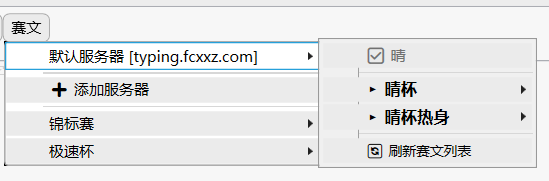
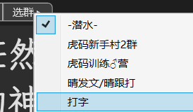

# 晴跟打 使用手册

一款小而美的跟打器，**自带超高性能发文和赛文，全功能免费**

文库包含400万段每段500字左右的随机文，可连Q群发文载文，错字慢字重打，趣味贪吃蛇模式~

基于[Pain打器](https://github.com/lvyww/paindutch)开发，在此致敬虎码作者+Pain作者+Bime作者：B佬@NoWayToSay，Pain维护人：雄霸天下@30~

[虎码官网](https://www.tiger-code.com/)
## 目录

1. [软件简介](#软件简介)
2. [快速开始](#快速开始)
3. [常用快捷键](#常用快捷键)
7. [赛文](#赛文)
8. [练单器](#练单器)
9. [常见问题](#常见问题)

---

## 软件简介

晴跟打是一款中文打字练习软件，支持多种练习模式和在线比赛功能，帮助用户提高打字速度和准确率。

支持的QQ版本为9.9.22.40990(不包含)之后的版本，目前版本为 9.9.26-44343，之后QQ不改格式的话应该都支持~

---

## 快速开始

### 第一次使用

1. **运行**：双击 `晴跟打.exe` 启动程序

2. **文来！**：
    - 文来按纽点击左键或Ctrl+R，可直接发文
    - 请根据提示注册登录，帐号同昵称，无注册限制，可使用中文，密码加密存储，作者也看不到，请自己保存好帐号密码
        - 设置页面可设置文来字数，文来难度，文来服务器地址
            - 待实现功能：Ctrl+P载本段文的下一段，看到感兴趣的部分可以继续往下看~
    - 文来按纽点击右键，可退出登录、切换服务器地址
        - 允许加入任何自建发文服务，默认发文接口地址：https://typing.fcxxz.com/
        - 自建方法：本地或服务器部署晴发文系统，马上开源~

3. **本地书籍跟打**：
    - 将 txt 文件放入软件目录的 `文章` 文件夹
    - 点击首页文章管理，发文

3. **赛文**：
    - 自定义赛文服务器
        - 允许加入任何自建赛文服务，默认赛文接口地址：https://typing.fcxxz.com/
        - 自建方法：本地或服务器部署晴发文系统，马上开源~
    - 其他赛文：已接入锦标赛，极速杯，如需接入其他赛文，可联系作者和对方开发人员对接

---

## 常用快捷键

| 快捷键 | 功能 |
|-------|------|
| F3 | 重新打当前文章 |
| F4 | 从QQ群加载文章 |

| Ctrl + R | 文来 |
| Ctrl + P | 下一段（暂时功能=文来） |
| Ctrl + L | 乱序重打 |

### 贪吃蛇模式

- 只显示当前位置前后的文字
- 前后显示字数可在设置中调整
- 在设置中开启"贪吃蛇模式"

---

## 赛文

### 参加比赛

1. 点击底部 `赛文` 菜单
2. 选择要参加的比赛类型
3. 系统自动加载比赛文章
4. 完成打字后成绩自动上传

### 查看排行榜
点击 `赛文` 菜单中的排行榜

---

## 练单器

练单器用于固定文本的重复练习，适合突破特定字词或段落。
- 每练完一组，会自动弹出本组平均成绩

---

## 常见问题

### Q: 新手如何提高打字速度？
- 多练前500，中500，后500
- 目标：前500总字数控制在800字左右的同时均击达到6击，再开始打文

### Q: 支持哪些文章格式？

A: 支持 txt 文本文件和 epub 电子书格式。

### Q: 如何调整字体大小？

A: 在对应窗口直接ctrl+鼠标滚轮，或设置页面

---

## 技术支持

如有问题请进Q群 715187175 中反馈。
